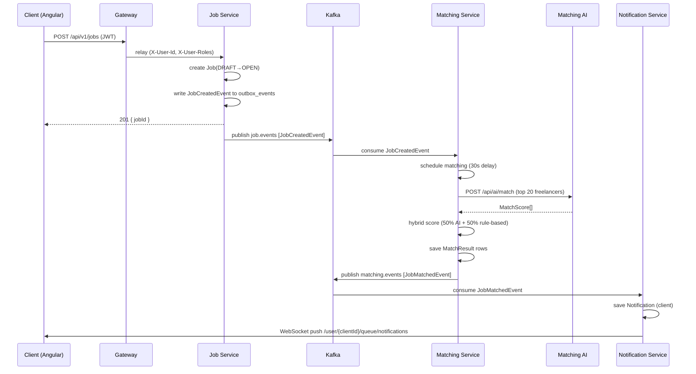
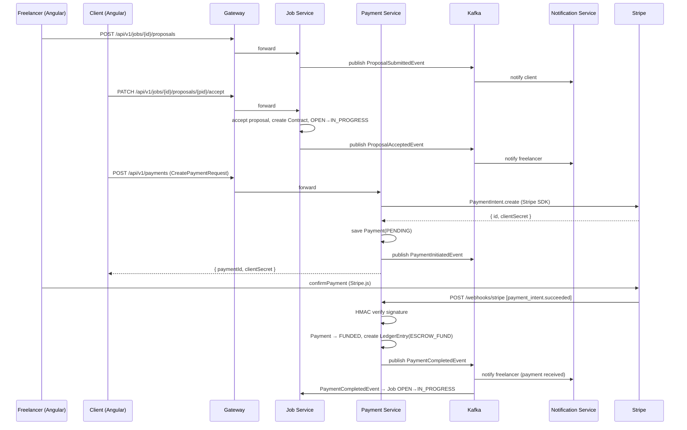
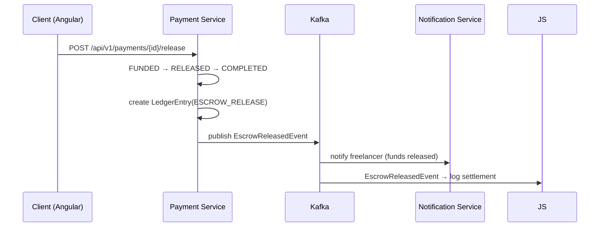

# Unikly — Architecture

## Table of Contents

1. [Overview](#overview)
2. [DDD Bounded Contexts](#ddd-bounded-contexts)
3. [Service Map](#service-map)
4. [Event Flow (Mermaid)](#event-flow)
5. [Kafka Topics](#kafka-topics)
6. [Data Ownership](#data-ownership)
7. [Security Architecture](#security-architecture)
8. [Resilience Patterns](#resilience-patterns)
9. [Observability Stack](#observability-stack)

---

## Overview

Unikly is an event-driven microservices platform. The guiding principles are:

- **Database per service** — no cross-service joins; each service owns its schema.
- **Async by default** — services communicate via Kafka events; REST is only for query reads and user-facing operations.
- **Outbox pattern** — events are written transactionally alongside domain state, then published by a scheduled poller; prevents dual-write inconsistency.
- **Idempotent consumers** — every Kafka consumer deduplicates using a `processed_events` table (or Elasticsearch document) keyed on event ID.
- **DLQ routing** — after 3 retries with 1 s backoff, failed messages land in `<service>.dlq` for manual inspection.

---

## DDD Bounded Contexts

```
┌─────────────────────────────────────────────────────────────────┐
│  Identity Context                                               │
│  Keycloak — users, roles, tokens, PKCE                         │
└────────────────────────┬────────────────────────────────────────┘
                         │ JWT (OIDC)
┌────────────────────────▼────────────────────────────────────────┐
│  User Context          │  Job Context                           │
│  user-service          │  job-service                           │
│  ─ UserProfile         │  ─ Job (state machine)                 │
│  ─ Review              │  ─ Proposal                            │
│                        │  ─ Contract                            │
└────────────────────────┴────────────────────────────────────────┘
         │ UserProfileUpdatedEvent      │ JobCreatedEvent
         │                             │ ProposalAcceptedEvent
┌────────▼────────────────────────────▼──────────────────────────┐
│  Matching Context      │  Payment Context                       │
│  matching-service      │  payment-service                       │
│  ─ MatchResult         │  ─ Payment (escrow state machine)      │
│  ─ FreelancerSkillCache│  ─ LedgerEntry                         │
│  matching-ai (Python)  │  ─ WebhookEvent (Stripe idempotency)  │
└────────────────────────┴────────────────────────────────────────┘
         │ JobMatchedEvent              │ PaymentCompletedEvent
         │                             │ EscrowReleasedEvent
┌────────▼────────────────────────────▼──────────────────────────┐
│  Messaging Context     │  Notification Context                  │
│  messaging-service     │  notification-service                  │
│  ─ Conversation        │  ─ Notification                        │
│  ─ Message             │  ─ NotificationPreference              │
│                        │  ─ JobClientCache (local read model)   │
└────────────────────────┴────────────────────────────────────────┘
                         │ All domain events
┌────────────────────────▼────────────────────────────────────────┐
│  Search Context                                                 │
│  search-service                                                 │
│  ─ JobDocument (ES)                                             │
│  ─ FreelancerDocument (ES)                                      │
└─────────────────────────────────────────────────────────────────┘
```

---

## Service Map

| Service | Port | DB | Key Dependencies |
|---|---|---|---|
| gateway | 8080 | — | Keycloak, Redis |
| job-service | 8081 | postgres-jobs:5433 | Kafka |
| user-service | 8082 | postgres-users:5434 | Kafka |
| payment-service | 8083 | postgres-payments:5435 | Kafka, Stripe |
| matching-service | 8084 | postgres-matching:5436 | Kafka, matching-ai |
| messaging-service | 8085 | postgres-messaging:5437 | Kafka, Redis |
| notification-service | 8086 | postgres-notifications:5438 | Kafka, Redis |
| search-service | 8087 | Elasticsearch 9200 | Kafka |
| matching-ai | 8090 | — | sentence-transformers |

---

## Event Flow

### Job Creation → Matching → Notification



### Proposal → Contract → Payment



### Escrow Release



---

## Kafka Topics

| Topic | Producers | Consumers |
|---|---|---|
| `job.events` | job-service | matching-service, notification-service, search-service |
| `payment.events` | payment-service | job-service, notification-service |
| `matching.events` | matching-service | notification-service |
| `messaging.events` | messaging-service | notification-service |
| `user.events` | user-service | matching-service, search-service |
| `notification.dlq` | notification-service error handler | manual |
| `payment.dlq` | payment-service error handler | manual |
| `job-service.dlq` | job-service error handler | manual |
| `search-service.dlq` | search-service error handler | manual |
| `matching-service.dlq` | matching-service error handler | manual |
| `messaging-service.dlq` | messaging-service error handler | manual |

All topics use **3 replicas** and **3 partitions** in production. KRaft mode (no ZooKeeper).

---

## Data Ownership

Each service has a dedicated PostgreSQL instance. No foreign keys cross service boundaries.

| Data Entity | Owner Service | Shared As |
|---|---|---|
| UserProfile | user-service | `FreelancerSkillCache` (matching), `FreelancerDocument` (search) |
| Job, Proposal, Contract | job-service | `JobDocument` (search), `JobClientCache` (notification) |
| Payment, LedgerEntry | payment-service | Amount in EscrowReleasedEvent payload |
| MatchResult | matching-service | Served via REST to job-service frontend |
| Message, Conversation | messaging-service | 100-char preview in MessageSentEvent |
| Notification | notification-service | — |

Read models (caches) in downstream services are **eventually consistent** — they are updated when the owner publishes a domain event.

---

## Security Architecture

```
Browser ──HTTPS──► Nginx ──► Gateway
                              │
                    ┌─────────┴──────────┐
                    │  JWT Validation    │
                    │  (Keycloak JWKS)   │
                    │                    │
                    │  Rate Limiting     │
                    │  100 req/min/user  │
                    │  (Redis)           │
                    │                    │
                    │  Circuit Breaker   │
                    │  (Resilience4j)    │
                    │                    │
                    │  Header Relay      │
                    │  X-User-Id         │
                    │  X-User-Roles      │
                    └─────────┬──────────┘
                              │ Internal HTTP (no JWT)
                    ┌─────────▼──────────┐
                    │  Downstream        │
                    │  Services          │
                    │  (trust headers)   │
                    └────────────────────┘
```

- Keycloak issues **JWT access tokens** (5 min TTL, HS256) via PKCE.
- Gateway validates token signature against Keycloak's JWKS endpoint.
- Gateway extracts `sub` → `X-User-Id` and `realm_access.roles` → `X-User-Roles`.
- Downstream services read `UserContext` from headers — no Keycloak calls in services.
- `/webhooks/**` is exempt from JWT (Stripe HMAC signature used instead).
- `/actuator/**` is exempt from JWT (internal network only).

---

## Resilience Patterns

| Pattern | Implementation | Config |
|---|---|---|
| Circuit Breaker | Resilience4j per-route (gateway) + `@CircuitBreaker` (StripeClient, AiMatchingClient) | 50% failure threshold, 30s open wait |
| Retry | `@Retry(name="stripe")` | 3 attempts, 1s base, ×2 exponential |
| Timeout | Resilience4j time limiter | 10s for Stripe calls |
| Rate Limiting | Spring Cloud Gateway Redis rate limiter | 100 req/min per user |
| DLQ | `DeadLetterPublishingRecoverer` | 3 retries × 1s backoff |
| Idempotency | `ProcessedEvent` table per consumer service | UUID event ID deduplication |
| Outbox | `OutboxEvent` table + `OutboxPublisher` scheduled poller | 500ms poll, 5 retry max |

---

## Observability Stack

| Concern | Tool | Endpoint |
|---|---|---|
| Metrics | Micrometer + Prometheus | `/actuator/prometheus` per service |
| Dashboards | Grafana | `http://localhost:3000` |
| Tracing | OpenTelemetry → Grafana Tempo | `http://tempo:4318/v1/traces` |
| Structured logs | Logstash JSON encoder (logback-spring.xml) | stdout → Docker log driver |
| MDC | `MdcUserIdFilter` — injects `userId`, `traceId`, `spanId` into every log line | automatic |
| Request logs | `RequestLoggingFilter` — `METHOD PATH user=X status=Y duration=Zms` | automatic |

Kafka observation is enabled on both producer (`spring.kafka.template.observation-enabled`) and consumer (`spring.kafka.listener.observation-enabled`) so `traceId` propagates through Kafka message headers.
